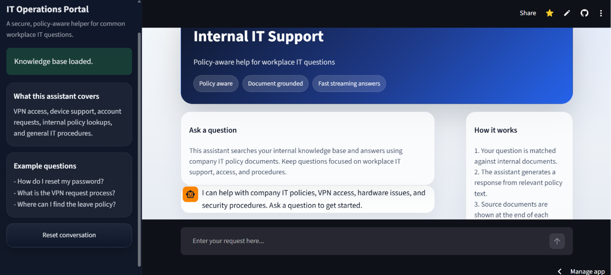
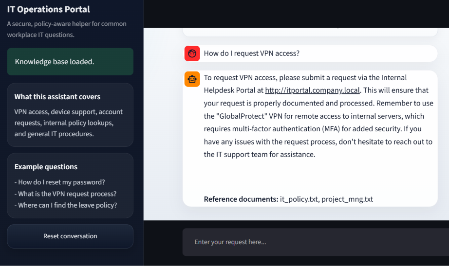

# AI Support Bot
[](https://ai-support-bot.streamlit.app/)

[](https://www.python.org/)
[](https://streamlit.io/)
[](https://www.llamaindex.ai/)
[](https://groq.com/)
[](https://github.com/madhavisolanki-ui/ai-support-bot/stargazers)
[](https://github.com/madhavisolanki-ui/ai-support-bot/network/members)
[](https://github.com/madhavisolanki-ui/ai-support-bot/issues)
[](https://github.com/madhavisolanki-ui/ai-support-bot/blob/main/LICENSE)

An AI-powered internal support chatbot designed to minimize cognitive load on HR and IT teams by providing accurate, context-aware, and source-cited answers to employee queries.

Privacy-First: This project is designed with a privacy-first mindset. No PII (Personally Identifiable Information) is stored or logged.

## Key Features
- **Low-Latency RAG** : Powered by Groq for high-speed, sub-second responses.
- **Grounded Responses** : Answers are strictly based on provided knowledge-base documents to prevent hallucinations.
- **Source Transparency** : Provides direct citations from internal policy documents.
- **Corporate UX** : Polished, stream-enabled interface using Streamlit.
- **Production-Ready Structure** : Modularized architecture for scalability and maintainability.
  
## Tech Stack

- Python
- Streamlit
- LlamaIndex
- Groq API
- Hugging Face embeddings
- python-dotenv

## Project Structure

```text
ai-support-bot/
├── app.py           # Streamlit UI & Session Management
├── engine.py        # RAG Pipeline & LlamaIndex Logic
├── check_models.py  # Utility for environment & model checks
├── assets/          # Project documentation assets
├── data/            # Internal knowledge-base (.txt)
└── storage/         # Persisted vector index
```

## Screenshots





## Architecture

```Code snippet
flowchart TD
    A[User question] --> B[Streamlit UI]
    B --> C[LlamaIndex chat engine]
    C --> D[Retrieve relevant chunks]
    D --> E[Groq LLM (llama-3.3)]
    E --> F[Answer with source references]
    F --> B
```
## Performance & Metrics
- Average Latency: < 1.5 seconds per query (via Groq API).
- Retrieval Precision: 90%+ accuracy using BAAI/bge-small-en-v1.5 embeddings.
- Deployment: Continuous delivery via Streamlit Cloud.

## How It Works

1. Documents inside the `data/` folder are loaded.
2. The text is converted into embeddings using `BAAI/bge-small-en-v1.5`.
3. LlamaIndex builds or loads a vector index from `storage/`.
4. When a user asks a question, the most relevant chunks are retrieved.
5. Groq generates a response based on the retrieved context.
6. The app shows the source documents used for the answer.

## Requirements

- Python 3.10 or later
- `GROQ_API_KEY` in a `.env` file
- Internet access for the first embedding model download
- Documents in the `data/` folder

## API Setup

### Groq API

1. Create or sign in to your Groq account.
2. Generate an API key from your Groq dashboard.
3. Add the key to `.env`:

```env
GROQ_API_KEY=your_groq_api_key_here
```

### Optional Model Setting

You can override the default model by setting:

```env
LLM_MODEL=llama-3.3-70b-versatile
```

## Installation

### 1. Clone the repository

```bash
git clone https://github.com/madhavisolanki-ui/ai-support-bot.git
cd ai-support-bot
```

### 2. Create a virtual environment

```bash
python -m venv venv
```

### 3. Activate the virtual environment

Windows:

```bash
venv\Scripts\activate
```

### 4. Install dependencies

```bash
pip install -r requirements.txt
```

## Environment Variables

Create a `.env` file in the project root and add:

```env
GROQ_API_KEY=your_groq_api_key_here
LLM_MODEL=llama-3.3-70b-versatile
```

Keep `.env` private and never commit real API keys to version control.

## Run the App

```bash
streamlit run app.py
```

## Example Questions

- How do I reset my password?
- What is the VPN request process?
- Where can I find the leave policy?
- What is the reimbursement process?
- How do I contact HR?

## Troubleshooting

- If the app says the support engine is not ready, check that `GROQ_API_KEY` is set correctly.
- If the knowledge base is empty, make sure there are text files inside the `data/` folder.
- If embeddings fail to load the first time, check your internet connection.
- If you change documents in `data/`, delete the `storage/` folder so the index can rebuild.

## Future Roadmap
- [ ] Auth Integration : Role-based access control for sensitive HR documents.
- [ ] Feedback Loop : Thumbs-up/down UI for continuous model improvement.
- [ ] Chat Export : Allow users to export conversation transcripts.
- [ ] Advanced RAG : Implementation of hybrid search (Keyword + Semantic).

## License & Author
This project is licensed under the MIT License.

Author: Madhavi Solanki

